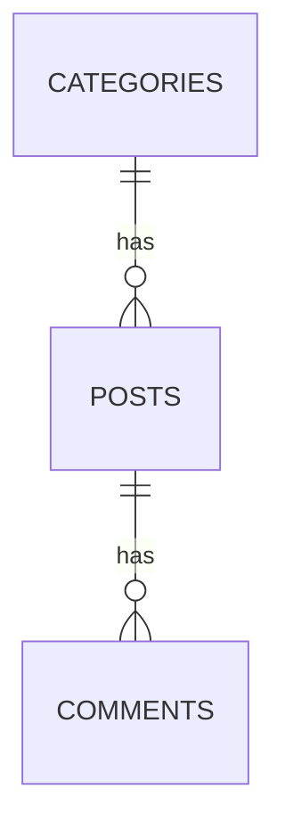

### 👻 LihimBoard

This is an imageboard PHP application that follows the Model-View-Controller (MVC) architectural pattern. 


### 🚀 Features

- 🕵️ Anonymous Posting
- 🔑 Tripcode Identification for Users
- 💬 Commenting System
- 📂 Category-based Posts
- 📄 Pagination for Posts
- 👀 View All Posts
- ⭐ Featured Post
- 🔍 Search Post
- 🎨 Color Themes / Dark Mode

### 📋 Prerequisites

- PHP
- MySQL
- Composer

### 🛠️ Project Setup 

1. Clone the repository:
    ```
    git clone https://github.com/jemcv/lihimboard.git
    cd lihimboard
    composer install
    ```

2. Set up the database:
    - Import the SQL file located at `config/schema.sql` into your MySQL database.

3. Configure the database connection:
    - Update the `config.php` file with your database credentials.

4. Update `php.ini` for larger image uploads (optional):
    - If you want to allow larger image uploads, you need to update your `php.ini` file.
    - Locate your `php.ini` file. 
    - Open the `php.ini` file in a text editor and increase the following settings:
        ```ini
        upload_max_filesize = 2M
        post_max_size = 2M
        ```
    - Restart your web server to apply the changes.

### 🖥️ Running the Server
To start the server, run the following command:

```
php -S localhost:8888 -t public
```

### 🌐 Usage

Navigate to http://localhost:8888 in your web browser to access the application.

### 🔍 Linter

This project uses [PHP_CodeSniffer](https://github.com/squizlabs/PHP_CodeSniffer) for linting. To check for coding standard violations, run:

```
vendor/bin/phpcs
```

### 🧪 Testing 

This project uses [PHPUnit](https://github.com/sebastianbergmann/phpunit) for testing. To run the tests, use the following command:

```
vendor/bin/phpunit
```

### 📊 Diagram

The diagram visually represents the relationships as follows:


CATEGORIES has a one-to-many relationship with POSTS. This means each category can have multiple posts.

POSTS has a one-to-many relationship with COMMENTS. This means each post can have multiple comments.

### 🗂️ Project Structure

```
lihimboard/
├── config/
│   └── config.php              # Database configuration
├── public/
│   ├── index.php               # Main entry point
│   └── uploads/                # Uploaded images directory
├── src/
│   ├── routes                  # Handles all the routes
│   ├── Router                  # Router class
│   ├── Database.php            # Database connection
│   ├── Controllers/            # Contains all the controllers
│   ├── Models/                 # Contains all the models
│   └── Views/                  # Contains all the views
├── tests/                      # Test files
├── composer.json               # Composer dependencies and autoload info
└── README.md                   # Project documentation
```

### 📜 License

This project is licensed under the MIT license.
